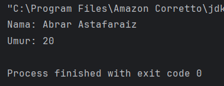
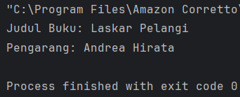
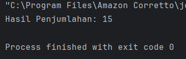
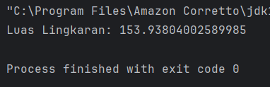
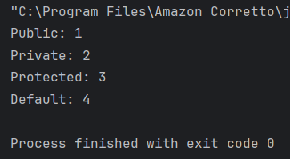
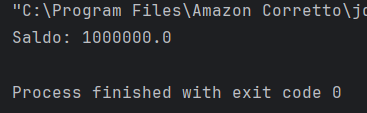
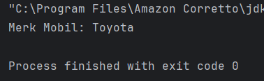
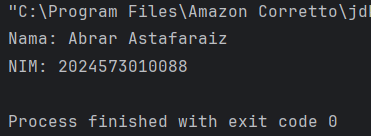
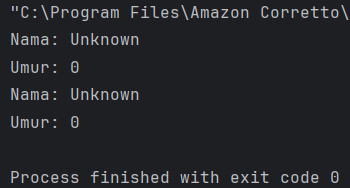
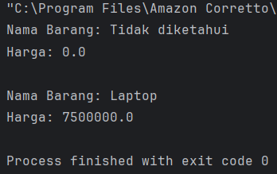

# Laporan Modul 2: Review Konsep Dasar OOP Menggunakan Java
**Mata Kuliah:** Praktikum Design Pattern  
**Nama:** Abrar Astafaraiz  
**NIM:** 2024573010088  
**Kelas:** TI 2A

---

## Tujuan
> 1. Memahami konsep dasar pemrograman berorientasi objek (OOP) dalam Java.
> 2. Mampu membuat dan menggunakan class, object, attribute, dan method.
> 3. Memahami penggunaan akses modifier (public, private, protected, default).
> 4. Mampu mengimplementasikan setter dan getter untuk mengakses dan memodifikasi attribute.
> 5. Memahami dan mengimplementasikan constructor (default, parameterized, dan constructor overloading).

---

## 1. Class dan Object
1. Class adalah blueprint atau cetakan untuk membuat objek. Class mendefinisikan atribut (variabel) dan method (fungsi) yang dimiliki oleh objek.
2. Object adalah instance dari class. Object memiliki state (nilai dari atribut) dan behavior (method).

### 1.1 Langkah Praktikum
1. Buka project pada praktikum sebelumnya menggunakan intellij IDEA
2. Buat sebuah package baru di dalam folder `src` dengan cara klik kanan pada folder `src` kemudian pilih `New -> Package`. Beri nama `praktikum_2`.
3. Buat Sebuah package baru lagi didalam package `praktikum_2` dengan cara klik kanan dan pilih `New -> Package`. Beri nama `bagian_1`
4. Kemudian buat sebuah class baru dengan nama `Mahasiswa` dan isikan kode berikut:

```declarative
package praktikum_2.bagian_1;

public class Mahasiswa {
    String nama;
    int umur;
}
```
5. Selanjutnya, buat sebuah class baru dengan nama ``Main`` dan isikan kode berikut:

```declarative
package praktikum_2.bagian_1;

import java.util.Scanner;

public class Main {
    public static void main(String[] args) {
        Mahasiswa mhs1 = new Mahasiswa();
        
        mhs1.nama = "Abrar Astafaraiz";
        mhs1.umur = 20;
        
        System.out.println("Nama: " + mhs1.nama);
        System.out.println("Umur: " + mhs1.umur);
    }
}
```
6. Jalankan dan lihat hasilnya.

### 1.2 Latihan
1. Buatlah class Buku dengan atribut judul dan pengarang.
2. Buat object dari class Buku dan isi nilai atributnya.
3. Tampilkan nilai atribut tersebut.

Kode Latihan:
```declarative
package praktikum_2.latihan.latihan_1;

class Buku {
    String judul;
    String pengarang;
}

public class Main {
    public static void main(String[] args) {
        Buku buku1 = new Buku();
        
        buku1.judul = "Laskar Pelangi";
        buku1.pengarang = "Andrea Hirata";
        
        System.out.println("Judul Buku: " + buku1.judul);
        System.out.println("Pengarang: " + buku1.pengarang);
    }
}
```

### 1.3 Hasil
Hasil Praktikum:  


hasil Latihan:  


## 2. Attribute dan Method
1. Attribute adalah variabel yang dimiliki oleh class atau object.
2. Method adalah fungsi atau perilaku yang dimiliki oleh class atau object.

### 2.1 Langkah Praktikum
1. Buat Sebuah package baru lagi didalam package `modul_2` dengan cara klik kanan dan pilih `New -> Package`. Beri nama `bagian_2`
2. Kemudian buat sebuah class baru dengan nama `Kalkulator` dan isikan kode berikut:
```declarative
package praktikum_2.bagian_2;

public class Kalkulator {
    int angka1;
    int angka2;
    
    int tambah() {
        return angka1 + angka2;
    }
}
```
3. Kemudian buat sebuah class baru dengan nama `Main` dan isikan kode berikut:
```declarative
package praktikum_2.bagian_2;

public class Main {
    public static void main(String[] args) {
        Kalkulator kalkulator = new Kalkulator();
        kalkulator.angka1 = 5;
        kalkulator.angka2 = 10;
        
        System.out.println("Hasil Penjumlahan: " + kalkulator.tambah());
    }
}
```
4. Jalankan program untuk melihat hasilnya.

### 2.2 Latihan
1. Buat class `Lingkaran` dengan atribut `jariJari`.
2. Tambahkan method `hitungLuas()` yang mengembalikan nilai luas lingkaran.
3. Buat object dari class Lingkaran dan panggil method `hitungLuas()`.

Kode Latihan:
```declarative
package praktikum_2.latihan.latihan_2;

public class Lingkaran {
    double jariJari;
    
    double hitungLuas() {
        return Math.PI * jariJari * jariJari;
    }
}

package praktikum_2.latihan.latihan_2;

public class Main {
    public static void main(String[] args) {
        Lingkaran lingkaran = new Lingkaran();
        
        lingkaran.jariJari = 7;
        
        System.out.println("Luas Lingkaran: " + lingkaran.hitungLuas());
    }
}
```

### 2.3 Hasil
Hasil Praktikum :  


Hasil Latihan :  


## 3. Akses Modifier
1. Akses Modifier menentukan tingkat akses dari class, atribut, atau method.
2. Jenis akses modifier:  
   * `public` : Dapat diakses dari mana saja.  
   * `private` : Hanya dapat diakses dalam class yang sama.  
   * `protected` : Dapat diakses dalam package yang sama dan subclass.  
   * `default` : Hanya dapat diakses dalam package yang sama.  

### 3.1 Langkah Praktikum
1. Buat Sebuah package baru lagi didalam package `modul_2` dengan cara klik kanan dan pilih `New -> Package`. Beri nama `bagian_3`
2. Kemudian buat sebuah class baru dengan nama `AksesModifier` dan isikan kode berikut:
```declarative
package praktikum_2.bagian_3;

public class AksesModifier {
    public int publicVar = 1;
    private int privateVar = 2;
    protected int protectedVar = 3;
    int defaultVar = 4;
    
    public void tampilkan() {
        System.out.println("Public: " + publicVar);
        System.out.println("Private: " + privateVar);
        System.out.println("Protected: " + protectedVar);
        System.out.println("Default: " + defaultVar);
    }
}
```
3. Kemudian buat sebuah class baru dengan nama `Main` dan isikan kode berikut:
```declarative
package praktikum_2.bagian_3;

public class Main {
    public static void main(String[] args) {
        AksesModifier contoh =  new AksesModifier();
        contoh.tampilkan();
    }
}
```
4. Jalankan program untuk melihat hasilnya.

### 3.2 Latihan
1. Buat class AkunBank dengan atribut `saldo (private)` dan method `tampilkanSaldo() (public)`.
2. Coba akses atribut saldo langsung dari luar class. Apa yang terjadi?

Kode Latihan:
```declarative
package praktikum_2.latihan.latihan_3;

public class AkunBank {
    private double saldo;
    
    public void tampilkanSaldo() {
        System.out.println("Saldo: " + saldo);
    }
    
    // optional: method untuk mengisi saldo
    public void setSaldo(double saldo) {
        this.saldo = saldo;
    }
}
```

### 3.3 Hasil
Hasil Praktikum :   


Hasil Latihan :  


## 4. Setter dan Getter
1. Setter adalah method untuk mengubah nilai atribut.
2. Getter adalah method untuk mengambil nilai atribut.
3. Setter dan Getter digunakan untuk mengakses atribut yang memiliki akses modifier private.

### 4.1 Langkah Praktikum
1. Buat Sebuah package baru lagi didalam package `modul_2` dengan cara klik kanan dan pilih `New -> Package`. Beri nama `bagian_4`
2. Kemudian buat sebuah class baru dengan nama `Mobil` dan isikan kode berikut:
```declarative
package praktikum_2.bagian_4;

public class Mobil {
    private String merk;
    
    public void setMerk(String merk) {
        this.merk = merk;
    }
    
    public String getMerk() {
        return merk;
    }
}
```
3. Kemudian buat sebuah class baru dengan nama `Main` dan isikan kode berikut:
```declarative
package praktikum_2.bagian_4;

public class Main {
    public static void main(String[] args) {
        Mobil mobil = new Mobil();
        mobil.setMerk("Toyota");
        
        System.out.println("Merk Mobil: " + mobil.getMerk());
    }
}
```
4. Jalankan program untuk melihat hasilnya.

### 4.2 Latihan
1. Buat class Mahasiswa dengan atribut nama (private) dan nim (private).
2. Buat setter dan getter untuk kedua atribut tersebut.
3. Buat object dari class Mahasiswa dan gunakan setter untuk mengisi nilai atribut.

Kode Latihan:
```declarative
package praktikum_2.latihan.latihan_4;

class Mahasiswa {
    private String nama;
    private String nim;

    // setter
    public void setNama(String nama) {
        this.nama = nama;
    }

    public void setNim(String nim) {
        this.nim = nim;
    }

    // getter
    public String getNama() {
        return nama;
    }

    public String getNim() {
        return nim;
    }
}

public class Main {
    public static void main(String[] args) {
        Mahasiswa mhs = new Mahasiswa();
        
        // menggunakan setter
        mhs.setNama("Abrar Astafaraiz");
        mhs.setNim("23012345");
        
        // menampilkan dengan getter
        System.out.println("Nama: " + mhs.getNama());
        System.out.println("NIM: " + mhs.getNim());
    }
}
```

### 4.3 Hasil
Hasil Praktikum:  


Hasil Latihan:   



## 5. Constructor
1. Constructor adalah method khusus yang dipanggil saat object dibuat.
2. Jenis constructor:  
   `Default Constructor` : Tanpa parameter.  
   `Parameterized Constructor` : Dengan parameter.  
   `Constructor Overloading` : Beberapa constructor dengan parameter berbeda.

### 5.1 Langkah Praktikum
1. Buat Sebuah package baru lagi didalam package `modul_2` dengan cara klik kanan dan pilih `New -> Package`. Beri nama `bagian_5`
2. Kemudian buat sebuah class baru dengan nama `Person` dan isikan kode berikut:
```declarative
package praktikum_2.bagian_5;

public class Person {
    private String nama;
    private int umur;
    
    public Person() {
        nama = "Unknown";
        umur = 0;
    }
    
    public Person(String nama, int umur) {
        this.nama = nama;
        this.umur = umur;
    }
    
    public void tampilkanInfo(){
        System.out.println("Nama: " + nama);
        System.out.println("Umur: " + umur);
    }
}
```
3. Kemudian buat sebuah class baru dengan nama `Main` dan isikan kode berikut:
```declarative
package praktikum_2.bagian_5;

public class Main {
    public static void main(String[] args) {
        Person person1 = new Person();
        Person person2 = new Person();
        
        person1.tampilkanInfo();
        person2.tampilkanInfo();
    }
}
```
4. Jalankan program untuk melihat hasilnya.

### 5.2 Latihan
1. Buat class `Barang` dengan atribut `namaBarang` dan `harga`.
2. Buat `default constructor` dan `parameterized constructor`.
3. Buat object dari class `Barang` menggunakan kedua constructor tersebut.

Kode Latihan:
```declarative
package praktikum_2.latihan.latihan_5;

class Barang {
    private String namaBarang;
    private double harga;

    // default constructor
    public Barang() {
        namaBarang = "Tidak diketahui";
        harga = 0;
    }

    // parameterized constructor
    public Barang(String namaBarang, double harga) {
        this.namaBarang = namaBarang;
        this.harga = harga;
    }

    public void tampilkanInfo() {
        System.out.println("Nama Barang: " + namaBarang);
        System.out.println("Harga: " + harga);
    }
}

public class Main {
    public static void main(String[] args) {
        // menggunakan default constructor
        Barang barang1 = new Barang();
        
        // menggunakan parameterized constructor
        Barang barang2 = new Barang("Laptop", 7500000);
        
        barang1.tampilkanInfo();
        System.out.println();
        barang2.tampilkanInfo();
    }
}
```

### 5.3 Hasil
Hasil Praktikum :   


Hasil Latihan :  


## 6. Sistem Manajemen Perpustakaan Sederhana
&emsp;&emsp;Berikut adalah contoh program konsol sederhana yang mengimplementasikan seluruh konsep yang telah dibahas sebelumnya, yaitu class, object, attribute, method, akses modifier, setter-getter, dan constructor. Program ini adalah sistem manajemen perpustakaan sederhana yang memungkinkan pengguna untuk menambahkan buku, menampilkan daftar buku, dan mencari buku berdasarkan judul.

### 6.1 Langkah Praktikum
1. Buat Sebuah package baru lagi didalam package `modul_2` dengan cara klik kanan dan pilih `New -> Package`. Beri nama `bagian_6`
2. Kemudian buat sebuah class baru dengan nama `Buku` dan isikan kode berikut:
```declarative
package praktikum_2.bagian_6;

public class Buku {
    private String judul;
    private String pengarang;
    private int tahunTerbit;
    
    public Buku() {
        this.judul = "Unknown";
        this.pengarang = "Unknown";
        this.tahunTerbit = 0;
    }
    
    public Buku(String judul, String pengarang, int tahunTerbit) {
        this.judul = judul;
        this.pengarang = pengarang;
        this.tahunTerbit = tahunTerbit;
    }
    
    public void setJudul(String judul) {
        this.judul = judul;
    }
    
    public String getJudul() {
        return judul;
    }
    
    public void setPengarang(String pengarang) {
        this.pengarang = pengarang;
    }
    
    public String getPengarang() {
        return pengarang;
    }
    
    public void setTahunTerbit(int tahunTerbit) {
        this.tahunTerbit = tahunTerbit;
    }
    
    public int getTahunTerbit() {
        return tahunTerbit;
    }
    
    public void tampilkanInfo() {
        System.out.println("Judul: " + judul);
        System.out.println("Pengarang: " + pengarang);
        System.out.println("Tahun Terbit: " + tahunTerbit);
        System.out.println("-------------------------------");
    }
}
```
3. Kemudian buat sebuah class baru dengan nama `Perpustakaan` dan isikan kode berikut:
```declarative
package praktikum_2.bagian_6;

import java.util.ArrayList;

public class Perpustakaan {
    private ArrayList<Buku> daftarBuku;

    public Perpustakaan(){
        daftarBuku = new ArrayList<>();
    }

    public void tambahBuku(Buku buku){
        daftarBuku.add(buku);
        System.out.println("Buku berhasil ditambahkan!");
    }

    public void tampilkanSemuaBuku() {
        if (daftarBuku.isEmpty()) {
            System.out.println("Tidak ada buku dalam perpustakaan.");
        } else {
            System.out.println("Daftar Buku: ");
            for (Buku buku : daftarBuku) {
                buku.tampilkanInfo();
            }
        }
    }

    public void cariBuku(String judul){
        boolean ditemukan = false;
        for (Buku buku : daftarBuku) {
            if (buku.getJudul().equalsIgnoreCase(judul)) {
                System.out.println("Buku ditemukan: ");
                buku.tampilkanInfo();
                ditemukan = true;
                break;
            }
        }

        if (!ditemukan) {
            System.out.println("Buku dengan judul \"" + judul + "\" tidak ditemukan.");
        }
    }
}
```
4. Kemudian buat sebuah class baru dengan nama `Main` dan isikan kode berikut:
```declarative
package praktikum_2.bagian_6;

import java.util.Scanner;

public class Main {
    public static void main(String[] args) {
        Scanner scanner = new Scanner(System.in);
        Perpustakaan perpustakaan = new Perpustakaan();
        int pilihan;

        do {
            System.out.println("\n=== Sistem Manajemen Perpustakaan ===");
            System.out.println("1. Perpustakaan");
            System.out.println("2. Perpustakaan");
            System.out.println("3. Perpustakaan");
            System.out.println("4. Perpustakaan");
            System.out.print("Pilih Menu: ");
            pilihan = scanner.nextInt();
            scanner.nextLine();

            switch (pilihan) {
                case 1:
                    System.out.print("Masukkan Judul Buku: ");
                    String judul = scanner.nextLine();
                    System.out.print("Masukkan Nama Pengarang: ");
                    String pengarang = scanner.nextLine();
                    System.out.print("Masukkan Tahun Terbit: ");
                    int tahunTerbit = scanner.nextInt();
                    scanner.nextLine();

                    Buku bukuBaru =  new Buku(judul, pengarang, tahunTerbit);
                    perpustakaan.tambahBuku(bukuBaru);
                    break;
                case 2:
                    perpustakaan.tampilkanSemuaBuku();
                    break;
                case 3:
                    System.out.print("Masukkan judul buku yang dicari: ");
                    String judulCari = scanner.nextLine();
                    perpustakaan.cariBuku(judulCari);
                    break;
                case 4:
                    System.out.println("Terima kasih telah menggunakan sistem ini!");
                    break;
                default:
                    System.out.println("Pilihan tidak valid. Silahkan coba lagi.");
            }
        } while (pilihan != 4);

        scanner.close();
    }
}
```
5. Jalankan program untuk melihat hasilnya.

### 6.2 Hasil
Hasil Praktikum:  


## Penutup
&emsp;&emsp;Dalam modul ini, kita telah mempelajari konsep dasar Pemrograman Berorientasi Objek (OOP) menggunakan Java, meliputi:
* Class dan Object: Blueprint dan instance untuk membangun program.
* Encapsulation: Menyembunyikan detail implementasi dengan access modifier dan getter-setter.
* Inheritance: Mewarisi atribut dan metode dari superclass ke subclass.
* Polymorphism: Method overriding dan overloading untuk fleksibilitas.
* Abstraction: Abstract class dan interface untuk menyembunyikan detail dan mendefinisikan kontrak.
* Composition: Membangun class dari objek-objek lain untuk hubungan "has-a".

&emsp;&emsp;Dengan memahami dan menguasai konsep-konsep ini, Anda dapat membangun aplikasi yang modular, fleksibel, dan mudah dipelihara. Teruslah berlatih dan eksplorasi lebih lanjut untuk menjadi programmer Java yang handal.