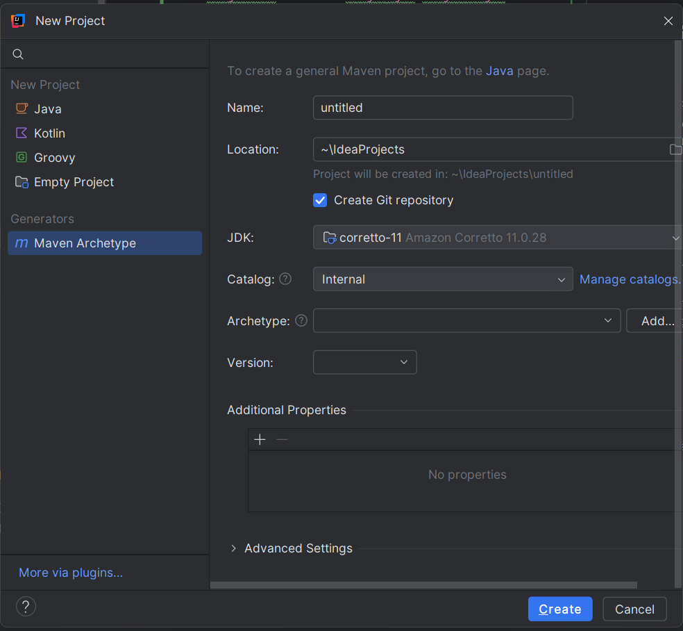

# Laporan Modul 1: Review Dasar Pemrograman Java
**Mata Kuliah:** Praktikum Design Pattern  
**Nama:** Abrar Astafaraiz  
**NIM:** 2024573010088  
**Kelas:** TI 2A

---

## Tujuan
1. Memahami sintaks dasar pemrograman Java.
2. Mampu membuat program sederhana menggunakan Java.
3. Memahami konsep variabel, tipe data, operator, percabangan, dan perulangan.
4. Mampu menyelesaikan masalah sederhana dengan menerapkan konsep dasar pemrograman Java.

## Outline Model
* Pengenalan Java dan Lingkungan Pengembangan
* Variabel dan Tipe Data
* Operator dan Ekspresi
* Percabangan (If-Else dan Switch-Case)
* Perulangan (For, While, Do-While)
* Practice Problem dan Solusi

---

## 1. Pengenalan Java dan Lingkungan Pengembangan
&emsp;&emsp;Java adalah bahasa pemrograman berorientasi objek yang populer dan banyak digunakan untuk pengembangan aplikasi desktop, web, dan mobile. Java menggunakan sintaks yang mirip dengan C++ tetapi dirancang untuk lebih mudah dipahami dan digunakan.

Untuk memulai pemrograman Java, Anda perlu:
1. JDK (Java Development Kit): Berisi compiler dan tools untuk mengembangkan program Java.
2. IDE (Integrated Development Environment): Seperti IntelliJ IDEA, Eclipse, atau NetBeans untuk menulis dan menjalankan kode.

### 1.1 Langkah Praktikum
1. Pastikan JDK dan Intellij IDE Community Edition sudah terinstal. Jika belum, kunjungi url berikut untuk mengunduh JDK Amazon Correto dan Intellij
2. Buka IDE dan buat sebuah project baru dengan ketentuan seperti berikut:

> * Name: ti_design_pattern
> * Location: disesuaikan
> * Build system: Intellij
> * JDK: Amazon Correto
> * Hilangkan centang pada bagian `add sample code`

Contoh:


3. Buat sebuah package baru di dalam folder src dengan cara klik kanan pada folder src kemudian pilih New -> Package. Beri nama modul_1.
4. Buat Sebuah class didalam package modul_1 dengan cara klik kanan dan pilih New -> Java Class. Beri nama HelloWorld
5. Isikan kode dibawah ini.
```declarative
package praktikum_1;

public class HelloWorld {
    public static void main(String[] args) {
        System.out.println("Hello, World!");
    }
}
```

6. Jalankan program.

Output:
