# Laporan Modul 3: Review 4 Pillar OOP Menggunakan Java
**Mata Kuliah:** Praktikum Design Pattern  
**Nama:** Abrar Astafaraiz  
**NIM:** 2024573010088  
**Kelas:** TI 2A

---

## Tujuan
> 1. Memahami konsep dasar OOP: Class, Object, Encapsulation, Inheritance, Polymorphism, dan Abstraction.
> 2. Mampu membuat program sederhana menggunakan konsep OOP.
> 3. Menerapkan prinsip-prinsip OOP dalam menyelesaikan masalah pemrograman.

---

## 1. Pengenalan OOP dan Class-Object
&emsp;&emsp;OOP (Object-Oriented Programming) adalah paradigma pemrograman yang menggunakan "objek" untuk merepresentasikan data dan metode yang beroperasi pada data tersebut.

Konsep dasar OOP:
1. Class: Blueprint atau template untuk membuat objek.
2. Object: Instance dari class yang memiliki atribut dan metode.

### 1.1 Langkah Praktikum
1. Buka project pada praktikum sebelumnya menggunakan intellij IDEA
2. Buat sebuah package baru di dalam folder `src` dengan cara klik kanan pada folder `src` kemudian pilih `New -> Package`. Beri nama `praktikum_3`.
3. Buat Sebuah package baru lagi didalam package `praktikum_3` dengan cara klik kanan dan pilih `New -> Package`. Beri nama `bagian_1`
4. Kemudian buat sebuah class baru dengan nama `Mahasiswa` dan isikan kode berikut:

```declarative
package praktikum_3.bagian_1;

public class Mahasiswa {
    String nama;
    int umur;

    void displayInfo() {
        System.out.println("Nama: " + nama);
        System.out.println("Umur: " + umur);
    }
}
```
5. Selanjutnya, buat sebuah class baru dengan nama ``Main`` dan isikan kode berikut:

```declarative
package praktikum_3.bagian_1;

public class Main {
    public static void main(String[] args) {
        Mahasiswa mhs1 =  new Mahasiswa();
        mhs1.nama = "Budi";
        mhs1.umur = 20;

        mhs1.displayInfo();
    }
}
```
6. Jalankan dan lihat hasilnya.

### 1.2 Latihan
1. Buat class Buku dengan atribut judul, penulis, dan tahunTerbit.
2. Buat objek dari class Buku dan tampilkan informasinya.

Kode Latihan: 
```declarative
package praktikum_3.bagian_1.latihan;

import praktikum_3.bagian_1.Mahasiswa;

public class Main {
    public static void main(String[] args) {
        Buku bk1 =  new Buku();
        bk1.judul = "Praktikum Design Pattern";
        bk1.penulis = "Abrar Astafaraiz";
        bk1.tahunTerbit = 2026;

        bk1.displayInfo();
    }
}
```
```declarative
package praktikum_3.bagian_1.latihan;

public class Buku {
    String judul;
    String penulis;
    int tahunTerbit;
    
    void displayInfo() {
        System.out.println("Judul: " + judul);
        System.out.println("Penulis: " + penulis);
        System.out.println("Tahun Terbit: " + tahunTerbit);
    }
}
```

### 1.3 Hasil
Hasil Praktikum:  
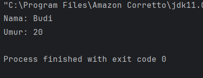

hasil Latihan:  
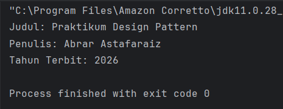

## 2. Encapsulation (Enkapsulasi)
&emsp;&emsp;Encapsulation adalah konsep menyembunyikan detail internal objek dan hanya mengekspos fungsionalitas yang diperlukan. Ini dilakukan dengan menggunakan access modifier (private, public, protected) dan getter-setter.

### 2.1 Langkah Praktikum
1. Buat Sebuah package baru lagi didalam package `praktikum_3` dengan cara klik kanan dan pilih `New -> Package`. Beri nama `bagian_2`
2. Kemudian buat sebuah class baru dengan nama `Mahasiswa` dan isikan kode berikut:
```declarative
package praktikum_3.bagian_2;

public class Mahasiswa {
    private String nama;
    private int umur;
    
    public String getNama() {
        return nama;
    }
    
    public void setNama(String nama) {
        this.nama = nama;
    }
    
    public int getUmur() {
        return umur;
    }
    
    public void setUmur(int umur) {
        this.umur = umur;
    }
}
```
3. Kemudian buat sebuah class baru dengan nama `Main` dan isikan kode berikut:
```declarative
package praktikum_3.bagian_2;

public class Main {
    public static void main(String[] args) {
        Mahasiswa mhs1 =  new Mahasiswa();
        mhs1.setNama("Mahesh");
        mhs1.setUmur(20);

        System.out.println("Nama : "+mhs1.getNama());
        System.out.println("Umur : "+mhs1.getUmur());
    }
}
```
4. Jalankan program untuk melihat hasilnya.

### 2.2 Latihan
1. Buat class Motor dengan atribut merk dan tahun yang dienkapsulasi.
2. Buat getter dan setter untuk atribut tersebut.

Kode Latihan:
```declarative
package praktikum_3.bagian_2.latihan;

class Motor {
    private String merk;
    private int tahun;

    public String getMerk() {
        return merk;
    }

    public void setMerk(String merk) {
        this.merk = merk;
    }

    public int getTahun() {
        return tahun;
    }

    public void setTahun(int tahun) {
        this.tahun = tahun;
    }
}

public class Main {
    public static void main(String[] args) {
        Motor mtr1 =  new Motor();
        mtr1.setMerk("N-Max");
        mtr1.setTahun(2026);
        
        System.out.println("Nama : "+mtr1.getMerk());
        System.out.println("Umur : "+mtr1.getTahun());
    }
}
```

### 2.3 Hasil
Hasil Praktikum :  
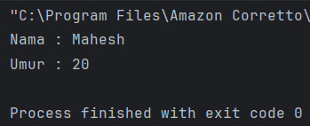

Hasil Latihan :  
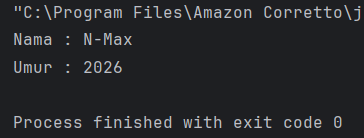

## 3. Inheritance (Pewarisan) dan Composition (Komposisi)
&emsp;&emsp;Dalam pemrograman berorientasi objek (OOP), Inheritance dan Composition adalah dua konsep penting yang digunakan untuk membangun hubungan antara class. Meskipun keduanya memiliki tujuan yang sama, yaitu mempromosikan reuseability (penggunaan kembali kode) dan modularitas, mereka memiliki pendekatan yang berbeda. Berikut adalah penjelasan lengkap tentang Composition dan perbandingannya dengan Inheritance.

**Inheritance (Pewarisan)**  
&emsp;&emsp;Inheritance adalah mekanisme di mana sebuah class (subclass/child class) mewarisi atribut dan metode dari class lain (superclass/parent class). Inheritance menggambarkan hubungan "is-a" (adalah). Misalnya, Kucing adalah Hewan.

**Ciri-Ciri Inheritance:**
* Menggunakan keyword extends.
* Subclass mewarisi semua atribut dan metode dari superclass (kecuali yang private).
* Subclass dapat menambahkan atribut dan metode baru, atau meng-override metode yang ada.
* Mendukung hierarki class (class dapat mewarisi dari satu superclass).

**Composition (Komposisi)**
&emsp;&emsp;Composition adalah mekanisme di mana sebuah class terdiri dari objek-objek dari class lain. Ini menggambarkan hubungan "has-a" (memiliki). Misalnya, Mobil memiliki Mesin. Composition memungkinkan kita untuk membangun class yang kompleks dengan menggabungkan objek-objek yang lebih sederhana.

**Ciri-Ciri Composition:**
* Menggunakan instance variabel dari class lain.
* Tidak ada keyword khusus, hanya menggunakan objek sebagai atribut.
* Lebih fleksibel daripada inheritance karena tidak terikat pada hierarki class.
* Mendukung reuseability tanpa perlu mewarisi class.

**Perbandingan Inheritance dan Composition**  

| Aspek          | Inheritance                                           | Composition                                          |
|:---------------|:------------------------------------------------------|:-----------------------------------------------------|
| Hubungan       | "is-a" (adalah)                                       | "has-a" (memiliki)                                   |
| Fleksibilitasx | Kurang fleksibel (terikat hierarki)                   | Lebih fleksibel (tidak terikat hierarki)             |
| Reusability    | Mewarisi semua atribut dan metode                     | Hanya menggunakan apa yang dibutuhkan                |
| Keyword        | extends                                               | Tidak ada keyword khusus                             |
| Keterikatan    | Kuat (subclass tergantung pada superclass)            | Lemah (class independen)                             |
| Penggunaan     | Cocok untuk class dengan hubungan hierarki yang jelas | Cocok untuk class yang terdiri dari objek-objek lain |

**Kapan Menggunakan Inheritance vs Composition?**  
Gunakan Inheritance Jika:
* Ada hubungan "is-a" yang jelas antara class. Misalnya, Mobil adalah Kendaraan.
* Anda ingin mewarisi semua atribut dan metode dari superclass.
* Anda ingin meng-override metode dari superclass.

Gunakan Composition Jika:
* Ada hubungan "has-a" antara class. Misalnya, Mobil memiliki Mesin. 
* Anda ingin membangun class yang terdiri dari beberapa objek yang lebih sederhana. 
* Anda ingin menghindari keterikatan yang kuat antara class (mengurangi coupling).

Kita juga bisa mengkombinasikan inheritance dengan composition.

### 3.1 Langkah Praktikum
#### 3.1.1 Langkah Praktikum Pewarisan
1. Buat Sebuah package baru lagi didalam package `praktikum_3` dengan cara klik kanan dan pilih `New -> Package`. Beri nama `bagian_3`
2. Buat package baru di dalam `bagian_3` dan beri nama `pewarisan`
3. Kemudian buat sebuah class baru dengan nama `Kendaraan` dan isikan kode berikut:
```declarative
package praktikum_3.bagian_3.pewarisan;

public class Kendaraan {
    String merk;
    int tahun;
    
    void displayInfo()  {
        System.out.println("Merk :" + merk);
        System.out.println("Tahun :" + tahun);
    }
}
```
4. Kemudian buat sebuah class baru dengan nama Mobil dan isikan kode berikut:
```declarative
package praktikum_3.bagian_3.pewarisan;

public class Mobil extends Kendaraan{
    int jumlahPintu;

    void displayInfoMobil() {
        displayInfo();
        System.out.println("Jumlah Pintu:" + jumlahPintu);
    }
}
```
5. Kemudian buat sebuah class baru dengan nama Main dan isikan kode berikut:
```declarative
package praktikum_3.bagian_3.pewarisan;

public class Main {
    public static void main(String[] args) {
        Mobil mbl1 = new Mobil();
        mbl1.merk = "Toyota";
        mbl1.tahun = 2021;
        mbl1.jumlahPintu = 4;

        mbl1.displayInfoMobil();
    }
}
```
6. Jalankan program dan lihat hasilnya.

#### 3.1.2 Langkah Praktikum komposisi
1. Buat package baru di dalam `bagian_3` dan beri nama `komposisi`
2. Kemudian buat sebuah class baru dengan nama `Mesin` dan isikan kode berikut:
```declarative
package praktikum_3.bagian_3.komposisi;

public class Mesin {
    public void hidupkan()  {
        System.out.println("Mesin menyala.");
    }
    
    public void matikan() {
        System.out.println("Mesin dimatikan.");
    }
}
```
3. Kemudian buat sebuah class baru dengan nama `Mobil` dan isikan kode berikut:
```declarative
package praktikum_3.bagian_3.komposisi;

public class Mobil {
    private final Mesin mesin;
    
    public Mobil() {
        this.mesin = new Mesin();
    }
    
    void mulai() {
        mesin.hidupkan();
        System.out.println("Mobil siap digunakan.");
    }
    
    void berhenti() {
        mesin.matikan();
        System.out.println("Mobil berhenti.");
    }
}
```
4. Kemudian buat sebuah class baru dengan nama `Main` dan isikan kode berikut:
```declarative
package praktikum_3.bagian_3.komposisi;

public class Main {
    public static void main(String[] args) {
        Mobil mobil = new Mobil();
        mobil.mulai();
        mobil.berhenti();
    }
}
```
6. Jalankan program dan lihat hasilnya.

#### 3.1.3 Langkah Praktikum Main
1. Di dalam package bagian_3, buat sebuah class baru dan beri nama Main dan isikan kode berikut:
```declarative
package praktikum_3.bagian_3;

import praktikum_3.bagian_3.komposisi.Mesin;

class mesin {
    void hidupkan() {
        System.out.println("Mesin menyala.");
    }

    void matikan() {
        System.out.println("Mesin dimatikan.");
    }
}

class kendaraan {
    void bergerak() {
        System.out.println("Kendaraan sedang bergerak.");
    }
}

class Mobil extends kendaraan {
    private Mesin mesin;

    public Mobil() {
        this.mesin = new Mesin();
    }

    void mulai() {
        mesin.hidupkan();
        System.out.println("Mobil siap digunakan.");
    }

    void berhenti() {
        mesin.matikan();
        System.out.println("Mobil berhenti.");
    }
}

public class Main {
    public static void main(String[] args) {
        Mobil mobil = new Mobil();
        mobil.mulai();
        mobil.bergerak();
        mobil.berhenti();
    }
}
```
2. Jalankan dan lihat hasilnya.

### 3.2 Latihan
1. Buat class `Laptop` yang memiliki komponen Processor dan RAM (gunakan composition).
2. Buat class `Processor` dengan metode `jalankan()`.
3. Buat class `RAM` dengan metode `baca()` dan `tulis()`.
4. Implementasikan class `Laptop` yang menggunakan objek `Processor` dan `RAM`.

Kode Latihan:
```declarative
package praktikum_3.bagian_3.latihan;

// Class Processor
class Processor {
    void jalankan() {
        System.out.println("Processor sedang berjalan");
    }
}

// Class RAM
class RAM {
    void baca() {
        System.out.println("RAM membaca data");
    }
    
    void tulis() {
        System.out.println("RAM menulis data");
    }
}

// Class Laptop (Composition)
class Laptop {
    private Processor processor;
    private RAM ram;
    
    // Constructor
    public Laptop() {
        this.processor = new Processor();
        this.ram = new RAM();
    }
    
    void nyalakanLaptop() {
        processor.jalankan();
        ram.baca();
        ram.tulis();
        System.out.println("Laptop dinyalakan");
    }
    
    void matikanLaptop() {
        System.out.println("Laptop dimatikan.");
    }
}

// Main class
public class Main {
    public static void main(String[] args) {
        Laptop laptop = new Laptop();
        laptop.nyalakanLaptop();
        laptop.matikanLaptop();
    }
}
```

### 3.3 Hasil
Hasil Praktikum :
1. Pewarisan  
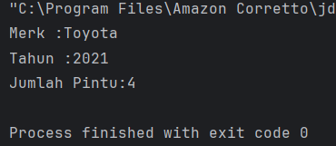  
2. Komposisi  
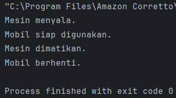  
3. Main  
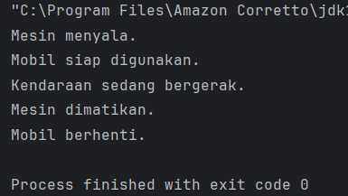  

Hasil Latihan :  
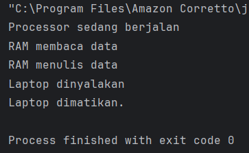

## 4. Polymorphism (Polimorfisme)
&emsp;&emsp;Polymorphism memungkinkan objek untuk memiliki banyak bentuk. Ini dapat dicapai melalui method overriding (mengganti metode di subclass) dan method overloading (beberapa metode dengan nama sama tetapi parameter berbeda).

**Method Overriding**  
&emsp;&emsp;Method overriding terjadi ketika subclass (class anak) menyediakan implementasi spesifik untuk method yang sudah didefinisikan di superclass (class induk). Method overriding digunakan untuk mengubah atau memperluas perilaku method yang diwarisi dari superclass. Method yang di-override harus memiliki nama, parameter, dan return type yang sama dengan method di superclass.

**Aturan Method Overriding:**
* Method harus memiliki nama dan parameter yang sama dengan method di superclass.
* Return type harus sama atau subtype dari return type di superclass.
* Access modifier tidak boleh lebih restriktif daripada method di superclass (misalnya, jika method di superclass protected, method di subclass bisa protected atau public).
* Method tidak bisa di-override jika di superclass dideklarasikan sebagai final.

**Method Overloading**  
&emsp;&emsp;Method overloading terjadi ketika sebuah class memiliki beberapa method dengan nama yang sama tetapi parameter yang berbeda (baik jumlah atau tipe parameternya). Method overloading digunakan untuk meningkatkan fleksibilitas dengan menyediakan beberapa cara untuk memanggil method yang sama.

**Aturan Method Overloading:**
* Method harus memiliki nama yang sama.
* Parameter harus berbeda (jumlah atau tipe).
* Return type bisa sama atau berbeda (tidak mempengaruhi overloading).
* Access modifier bisa sama atau berbeda.

**Perbandingan Overriding dan Overloading**  

| Aspek	| Overriding | Overloading                                              |
|:------|:-----------|:---------------------------------------------------------|
| Definisi | Mengganti implementasi method di subclass	| Membuat method dengan nama sama tetapi parameter berbeda |
| Parameter	| Harus sama | Harus berbeda                                            |
| Return Type | Harus sama atau subtype | Bisa berbeda                                             |
| Class | Terjadi antara superclass dan subclass | Terjadi dalam satu class                                 |
| Tujuan | Mengubah perilaku method yang diwarisi | Memberikan fleksibilitas dalam pemanggilan method        |
| Keyword | @Override (opsional) | Tidak ada keyword khusus                                 |

### 4.1 Langkah Praktikum
#### 4.1.1 Langkah Praktikum Overriding
1. Buat Sebuah package baru lagi didalam package `praktikum_3` dengan cara klik kanan dan pilih `New -> Package`. Beri nama `bagian_4`
2. Kemudian buat sebuah package baru di dalam `bagian_4` dan beri nama `overriding`
3. Kemudian buat sebuah class baru dengan nama `Hewan` dan isikan kode berikut:
```declarative
package praktikum_3.bagian_4.overriding;

public class Hewan {
    void bersuara (){
        System.out.println("Hewan bersuara.");
    }
}
```
4. Kemudian buat sebuah class baru dengan nama `Kucing` dan isikan kode berikut:
```declarative
package praktikum_3.bagian_4.overriding;

public class Kucing extends Hewan {
    @Override
    void bersuara (){
        System.out.println("Meong!");
    }
}
```
5. Kemudian buat sebuah class baru dengan nama `Anjing` dan isikan kode berikut:
```declarative
package praktikum_3.bagian_4.overriding;

public class Anjing extends Hewan {
    @Override
    void bersuara (){
        System.out.println("Guk Guk!");
    }
}
```
6. Kemudian buat sebuah class baru dengan nama `Main` dan isikan kode berikut:
```declarative
package praktikum_3.bagian_4.overriding;

public class Main {
    public static void main(String[] args) {
        Hewan hewan1 = new Kucing();
        Hewan hewan2 = new Anjing();

        hewan1.bersuara();
        hewan2.bersuara();
    }
}
```
7. Jalankan program untuk melihat hasilnya.

#### 4.1.2 Langkah Praktikum Overloading
1. Buat sebuah package baru di dalam `bagian_4` dan beri nama `overloading`
2. Kemudian buat sebuah class baru dengan nama `Kalkulator` dan isikan kode berikut:
```declarative
package praktikum_3.bagian_4.overloading;

public class Kalkulator {
    int tambah (int a, int b){
        return a + b;
    }
    
    int  tambah (int a, int b, int c){
        return a + b + c;
    }
    
    double tambah (double a, double b){
        return a + b;
    }
}
```
3. Kemudian buat sebuah class baru dengan nama `Main` dan isikan kode berikut:
```declarative
package praktikum_3.bagian_4.overloading;

public class Main {
    public static void main(String[] args) {
        Kalkulator kalkulator = new Kalkulator();

        System.out.println("Hasil 1: " + kalkulator.tambah(5, 10));
        System.out.println("Hasil 2: " + kalkulator.tambah(5, 10, 15));
        System.out.println("Hasil 3: " + kalkulator.tambah(3.5, 2.5));
    }
}
```
4. Jalankan program untuk melihat hasilnya.

### 4.2 Latihan
**Latihan 1: Overriding**  
1. Buat class BangunDatar dengan method hitungLuas().
2. Buat subclass Persegi dan Lingkaran yang meng-override method hitungLuas().
3. Implementasikan method hitungLuas() di masing-masing subclass.

**Latihan 2: Overloading**  
1. Buat class Matematika dengan method tambah() yang dapat menerima 2 atau 3 parameter bertipe int.
2. Tambahkan method tambah() yang menerima 2 parameter bertipe double.

Kode Latihan 1:
```declarative
package praktikum_3.bagian_4.overriding.latihan;

class BangunDatar {
    double hitungLuas() {
        System.out.println("Menghitung luas bangun datar.");
        return 0;
    }
}

class Persegi extends BangunDatar {
    double sisi;
    
    public Persegi(double sisi) {
        this.sisi = sisi;
    }
    
    @Override
    double hitungLuas() {
        return sisi * sisi;
    }
}

class Lingkaran extends BangunDatar {
    double jariJari;
    
    public Lingkaran(double jariJari) {
        this.jariJari = jariJari;
    }
    
    @Override
    double hitungLuas() {
        return Math.PI * jariJari * jariJari;
    }
}

public class Main {
    public static void main(String[] args) {
        BangunDatar bd1 = new Persegi(4);
        BangunDatar bd2 = new Lingkaran(7);
        
        System.out.println("Luas Persegi: " + bd1.hitungLuas());
        System.out.println("Luas Lingkaran: " + bd2.hitungLuas());
    }
}
```

Kode Latihan 2:
```declarative
package praktikum_3.bagian_4.overloading.latihan;

class Matematika {

    int tambah(int a, int b) {
        return a + b;
    }

    int tambah(int a, int b, int c) {
        return a + b + c;
    }

    double tambah(double a, double b) {
        return a + b;
    }
}

package praktikum_3.bagian_4.overloading.latihan;

public class Main {
    public static void main(String[] args) {
        Matematika mtk = new Matematika();
        
        System.out.println("Hasil 1: " + mtk.tambah(5, 10));
        System.out.println("Hasil 2: " + mtk.tambah(5, 10, 15));
        System.out.println("Hasil 3: " + mtk.tambah(3.5, 2.5));
    }
}
```

### 4.3 Hasil
Hasil Praktikum :
1. Overriding  
   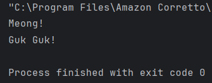
2. Overloading  
   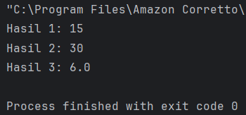

Hasil Latihan :
1. Overriding  
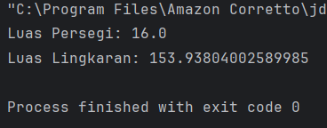
2. Overloading  
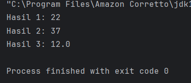

## 5. Abstraction (Abstraksi) | Abstract Class dan Interface
&emsp;&emsp;Pada konsep OOP (Object-Oriented Programming), Abstraction adalah salah satu dari empat pilar utama (bersama Encapsulation, Inheritance, dan Polymorphism). Abstraction memungkinkan kita untuk menyembunyikan detail implementasi dan hanya menampilkan fungsionalitas yang diperlukan kepada pengguna. Di Java, abstraction dapat diimplementasikan menggunakan Abstract Class dan Interface.

**Abstract Class**  
&emsp;&emsp;Abstract class adalah class yang tidak dapat diinstansiasi (tidak bisa dibuat objeknya langsung). Abstract class dapat memiliki method abstrak (tanpa implementasi) dan method konkret (dengan implementasi). Abstract class digunakan ketika kita ingin membuat blueprint untuk class-class lain yang memiliki perilaku serupa tetapi dengan implementasi yang berbeda.

**Ciri-Ciri Abstract Class:**  
* Dideklarasikan dengan keyword abstract.
* Dapat memiliki atribut, method konkret, dan method abstrak.
* Method abstrak tidak memiliki body (hanya deklarasi).
* Subclass yang mewarisi abstract class harus mengimplementasikan semua method abstrak (kecuali subclass tersebut juga abstract).

**Interface**  
&emsp;&emsp;Interface adalah blueprint untuk class yang hanya berisi method abstrak (sebelum Java 8) atau method default/static (mulai Java 8). Interface digunakan untuk mendefinisikan kontrak (contract) yang harus diimplementasikan oleh class-class yang menggunakannya. Sebuah class dapat mengimplementasikan banyak interface (multiple inheritance).

**Ciri-Ciri Interface:**  
* Dideklarasikan dengan keyword interface.
* Semua method di interface secara default adalah public dan abstract (tidak perlu menuliskan keyword abstract).
* Mulai Java 8, interface dapat memiliki method default (dengan implementasi) dan method static.
* Mulai Java 9, interface dapat memiliki method private.
* Interface tidak dapat memiliki atribut non-static (hanya konstanta, yaitu public static final).

**Perbandingan Abstract Class dan Interface**

| Aspek       | Abstract Class                           | Interface                                                                                   |  
|:------------|:-----------------------------------------|:--------------------------------------------------------------------------------------------|  
| Keyword     | abstract class                           | interface                                                                                   |  
| Method      | Bisa memiliki method abstrak dan konkret | Sebelum Java 8: hanya method abstrak.<br/>Java 8+: bisa memiliki method default dan static. |
| Atribut     | Bisa memiliki atribut non-static         | Hanya bisa memiliki konstanta (public static final)                                         |
| Constructor | Bisa memiliki constructor                | Tidak bisa memiliki constructor                                                             |
| Inheritance | Subclass hanya bisa mewarisi satu abstract class | Class bisa mengimplementasikan banyak interface                                             |
| Penggunaan | Cocok untuk class-class yang memiliki hubungan "is-a" (misalnya, Kucing adalah Hewan) | Cocok untuk mendefinisikan kontrak atau kemampuan (misalnya, Bergerak, Terbang) |

**Kapan Menggunakan Abstract Class dan Interface**  
Gunakan Abstract Class Jika:  
* Anda ingin membuat blueprint untuk class-class yang memiliki perilaku dan atribut yang sama.
* Anda ingin memiliki method konkret yang dapat diwarisi oleh subclass.
* Anda ingin mengontrol state objek melalui atribut non-static. 

Gunakan Interface Jika:  
* Anda ingin mendefinisikan kontrak atau kemampuan yang harus diimplementasikan oleh class-class yang berbeda.
* Anda ingin mendukung multiple inheritance (sebuah class bisa mengimplementasikan banyak interface).
* Anda ingin menambahkan fungsionalitas tambahan ke class tanpa mengubah struktur class tersebut (menggunakan method default di Java 8+).
* Dalam Sebuah program, kita juga dapat mengkombinasikan abstract class dengan interface.

### 5.1 Langkah Praktikum
#### 5.1.1 Langkah Praktikum Abstrak
1. Buat Sebuah package baru lagi didalam package modul_3 dengan cara klik kanan dan pilih New -> Package. Beri nama bagian_5
2. Buat sebuah package baru di dalam bagian_5 dan beri nama abstrak.
3. Kemudian buat sebuah class baru di dalam abtrak dengan nama Hewan dan isikan kode berikut:
```declarative
package praktikum_3.bagian_5.abstrak;

abstract class Hewan {
    String nama;
    
    void makan() {
        System.out.println(nama + " sedang makan.");
    }
    
    abstract void bersuara();
}
```
4. Kemudian buat sebuah class baru dengan nama `Kucing` dan isikan kode berikut:
```declarative
package praktikum_3.bagian_5.abstrak;

public class Kucing extends Hewan {
    @Override
    void bersuara() {
        System.out.println("Meong!");
    }
}
```
5. Kemudian buat sebuah class baru dengan nama `Anjing` dan isikan kode berikut:
```declarative
package praktikum_3.bagian_5.abstrak;

public class Anjing extends Hewan {
    @Override
    void bersuara()
    {
        System.out.println("Guk Guk!");
    }
}
```
6. Kemudian buat sebuah class baru dengan nama `Main` dan isikan kode berikut:
```declarative
package praktikum_3.bagian_5.abstrak;

public class Main {
    public static void main(String[] args) {
        Hewan kucing = new Kucing();
        kucing.nama = "Kitty";
        kucing.makan();
        kucing.bersuara();
        
        Hewan anjing =  new Anjing();
        anjing.nama = "Doggy";
        anjing.makan();
        anjing.bersuara();
    }
}
```
7. Jalankan program untuk melihat hasilnya.

#### 5.1.2 Langkah Praktikum Antarmuka
1. Buat sebuah package baru di dalam `bagian_5` dan beri nama `antarmuka`.
2. Kemudian buat sebuah interface baru di dalam `antarmuka` dengan nama `Bergerak` dan isikan kode berikut:
```declarative
package praktikum_3.bagian_5.antarmuka;

public interface Bergerak {
    void bergerak();
    
    default void berhenti() {
        System.out.println("Berhenti bergerak.");
    }
    
    static void info() {
        System.out.println("Ini adalah Interface Bergerak.");
    }
}
```
3. Kemudian buat sebuah class baru di dalam `antarmuka` dengan nama `Mobil` dan isikan kode berikut:
```declarative
package praktikum_3.bagian_5.antarmuka

public class Mobil implements Bergerak {
    
    @Override
    public void bergerak() {
        System.out.println("Mobil sedang melaju.");
    }
}
```
4. Kemudian buat sebuah class baru di dalam `antarmuka` dengan nama `Pesawat` dan isikan kode berikut:
```declarative
package praktikum_3.bagian_5.antarmuka;

public class Pesawat implements Bergerak {
    @Override
    public void bergerak() {
        System.out.println("Pesawat sedang terbang.");
    }
}
```
5. Kemudian buat sebuah class baru dengan nama `Main` dan isikan kode berikut:
```declarative
package praktikum_3.bagian_5.antarmuka;

public class Main {
    public static void main(String[] args) {
        Bergerak mobil = new Mobil();
        mobil.bergerak();
        mobil.berhenti();

        Bergerak pesawat = new Pesawat();
        pesawat.bergerak();
        pesawat.berhenti();

        Bergerak.info();
    }
}
```
6. Jalankan program untuk melihat hasilnya.

#### 5.1.3 Langkah Praktikum Main
1. Didalam package `bagian_5`, buatlah sebuah class baru dan beri nama `Main` dan isikan kode berikut:
```declarative
package praktikum_3.bagian_5;

interface Terbang {
    void terbang();
}

abstract class Hewan {
    String nama;
    
    abstract void bersuara();
}

class Burung extends Hewan implements Terbang {
    @Override
    public void bersuara() {
        System.out.println("Kicau Kicau.");
    }
    
    @Override
    public void terbang() {
        System.out.println(nama + " sedang terbang.");
    }
}

public class Main {
    public static void main(String[] args) {
        Burung burung = new Burung();
        burung.nama = "Merpati";
        burung.bersuara();
        burung.terbang();
    }
}
```
2. Jalankan program untuk melihat hasilnya.

### 5.2 Latihan
1. Buat sebuah interface `Berenang` dengan method `berenang()`.
2. Buat abstract class `HewanAir` dengan atribut `nama` dan method abstrak `makan()`.
3. Buat class `Ikan` yang mewarisi `HewanAir` dan mengimplementasikan `Berenang`.
4. Implementasikan method `berenang()` dan `makan()` di class `Ikan`.

Kode Latihan:
```declarative
package praktikum_3.bagian_5.latihan;

interface Berenang {
    void berenang();
}

abstract class HewanAir {
    String nama;

    abstract void makan();
}

class Ikan extends HewanAir implements Berenang {

    @Override
    public void berenang() {
        System.out.println(nama + " sedang berenang.");
    }

    @Override
    void makan() {
        System.out.println(nama + " sedang makan di air.");
    }
}

public class Main {
    public static void main(String[] args) {
        Ikan ikan = new Ikan();
        ikan.nama = "Ikan Nemo";

        ikan.makan();
        ikan.berenang();
    }
}
```

### 5.3 Hasil
Hasil Praktikum :
1. Abstrak  
   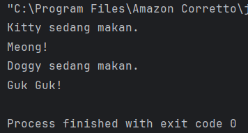
2. Antarmuka  
   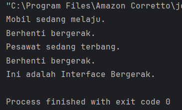
3. Main  
   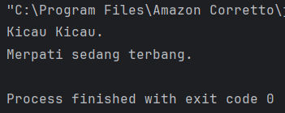

Hasil Latihan :  
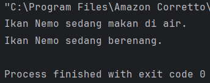

## 6. Aplikasi Console Pemesanan Tiket Sederhana
&emsp;&emsp;Berikut adalah contoh aplikasi console pemesanan tiket untuk sebuah konferensi yang mengimplementasikan seluruh konsep OOP (Class, Object, Encapsulation, Inheritance, Polymorphism, dan Abstraction). Aplikasi ini memiliki fitur lengkap seperti:
1. Menampilkan daftar tiket yang tersedia.
2. Memesan tiket. 
3. Melihat detail pesanan. 
4. Membatalkan pesanan. 
5. Menghitung total harga. 
6. Menerapkan diskon berdasarkan jenis tiket.

### 6.1 Langkah Praktikum
1. Buat Sebuah package baru lagi didalam package `praktikum_3` dengan cara klik kanan dan pilih `New -> Package`. Beri nama `bagian_6`
2. Kemudian buat sebuah class baru dengan nama `Tiket` dan isikan kode berikut:
```declarative
package praktikum_3.bagian_4.overriding;

public class Hewan {
    void bersuara (){
        System.out.println("Hewan bersuara.");
    }
}
```
3. Kemudian buat sebuah class baru dengan nama `TiketReguler` dan isikan kode berikut:
```declarative
package praktikum_3.bagian_4.overriding;

public class Kucing extends Hewan {
    @Override
    void bersuara (){
        System.out.println("Meong!");
    }
}
```
4. Kemudian buat sebuah class baru dengan nama `TiketVIP` dan isikan kode berikut:
```declarative
package praktikum_3.bagian_4.overriding;

public class Anjing extends Hewan {
    @Override
    void bersuara (){
        System.out.println("Guk Guk!");
    }
}
```
5. Kemudian buat sebuah class baru dengan nama `Pesanan` dan isikan kode berikut:
```declarative
package praktikum_3.bagian_4.overriding;

public class Main {
    public static void main(String[] args) {
        Hewan hewan1 = new Kucing();
        Hewan hewan2 = new Anjing();

        hewan1.bersuara();
        hewan2.bersuara();
    }
}
```
6. Kemudian buat sebuah class baru dengan nama KonferensiApp dan isikan kode berikut:
```declarative
package praktikum_3.bagian_6;

import java.util.ArrayList;
import java.util.Scanner;

public class KonferensiApp {
    private static final ArrayList<Pesanan> daftarPesanan = new ArrayList<>();
    private static final Scanner scanner = new Scanner(System.in);

    public static void main(String[] args) {
        while (true) {
            System.out.println("\n=== Aplikasi Pemesanan Tiket Konferensi ===");
            System.out.println("1. Lihat Daftar Tiket");
            System.out.println("2. Pesan Tiket");
            System.out.println("3. Lihat Detail Pesanan");
            System.out.println("4. Batalkan Pesanan");
            System.out.println("5. Keluar");
            System.out.println("Pilih Menu: ");
            int pilihan = scanner.nextInt();
            scanner.nextLine();

            switch (pilihan) {
                case 1:
                    lihatDaftarTiket();
                    break;
                case 2:
                    pesanTiket();
                    break;
                case 3:
                    lihatDetailPesanan();
                    break;
                case 4:
                    batalkanPesanan();
                    break;
                case 5:
                    System.out.println("Terimakasih telah menggunakan aplikasi ini.");
                    System.exit(0);
                default:
                    System.out.println("Pilihan tidak valid. Silahkan coba lagi.");
            }
        }
    }

    private static void lihatDaftarTiket() {
        System.out.println("\nDaftar Tiket:");
        System.out.println("1. Tiket Reguler - Rp100.000");
        System.out.println("2. Tiket VIP - Rp250.000 (Diskon 10%)");
    }

    private static void pesanTiket() {
        System.out.print("Masukkan Nama Pemesan: ");
        String namaPemesan = scanner.nextLine();

        System.out.print("Pilih Jenis Tiket (1: Reguler, 2: VIP): ");
        int jenisTiket = scanner.nextInt();
        System.out.print("Masukkan Jumlah Tiket: ");
        int jumlah = scanner.nextInt();

        Tiket tiket = null;
        switch (jenisTiket) {
            case 1:
                tiket = new TiketReguler();
                break;
            case 2:
                tiket = new TiketVIP();
                break;
            default:
                System.out.println("Jenis tiket tidak valid.");
                return;
        }

        Pesanan pesanan = new Pesanan(namaPemesan, tiket, jumlah);
        daftarPesanan.add(pesanan);
        System.out.println("Pesanan berhasil dibuat!");
        pesanan.displayDetail();
    }

    private static void lihatDetailPesanan() {
        if (isNoPesanan()) return;

        System.out.print("Pilih nomor pesanan untuk melihat detail: ");
        int nomorPesanan = scanner.nextInt();
        if (nomorPesanan > 0 && nomorPesanan <= daftarPesanan.size()) {
            daftarPesanan.get(nomorPesanan - 1).displayDetail();
        } else {
            System.out.println("Nomor pesanan tidak valid.");
        }

    }

    private static boolean isNoPesanan() {
        if (daftarPesanan.isEmpty()) {
            System.out.println("\nBelum ada pesanan.");
            return true;
        }

        System.out.println("\nDaftar Pesanan:");
        for (int i = 0; i < daftarPesanan.size(); i++) {
            System.out.println((i + 1) + ". " + daftarPesanan.get(i).getNamaPemesan());
        }
        return false;
    }

    private static void batalkanPesanan() {
        if (isNoPesanan()) return;

        System.out.print("Pilih nomor pesanan yang ingin dibatalkan: ");
        int nomorPesanan = scanner.nextInt();
        if (nomorPesanan > 0 && nomorPesanan <= daftarPesanan.size()) {
            daftarPesanan.remove(nomorPesanan - 1);
            System.out.println("Pesanan berhasil dibatalkan.");
        } else {
            System.out.println("Nomor pesanan tidak valid.");
        }
    }
}
```
7. Jalankan program untuk melihat hasilnya.

### 6.2 Hasil
Hasil Praktikum:  
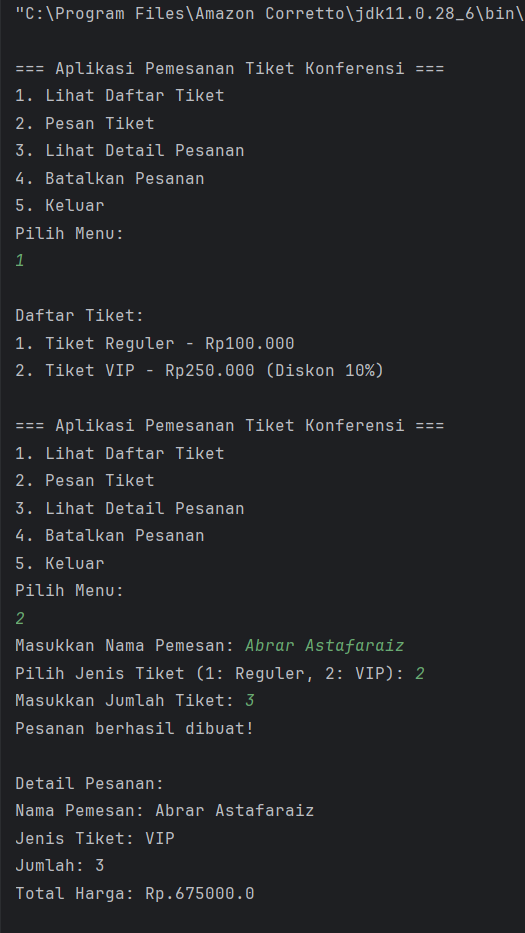
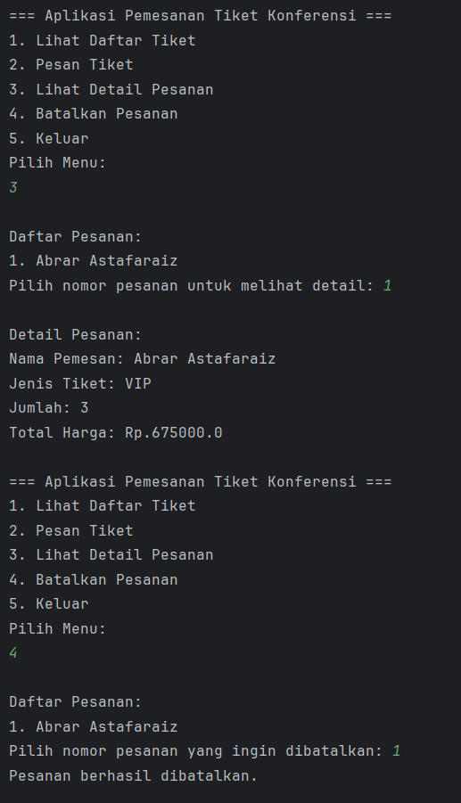
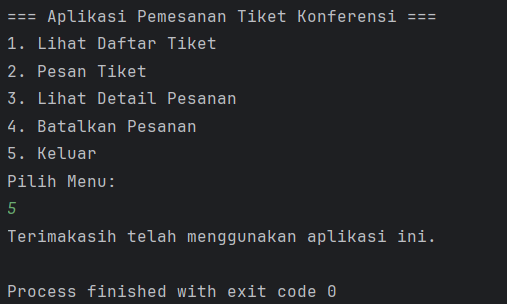

## Penutup
&emsp;&emsp;Dalam modul ini, kita telah mempelajari konsep dasar Pemrograman Berorientasi Objek (OOP) menggunakan Java, meliputi:
* Class dan Object: Blueprint dan instance untuk membangun program.
* Encapsulation: Menyembunyikan detail implementasi dengan access modifier dan getter-setter.
* Inheritance: Mewarisi atribut dan metode dari superclass ke subclass.
* Polymorphism: Method overriding dan overloading untuk fleksibilitas.
* Abstraction: Abstract class dan interface untuk menyembunyikan detail dan mendefinisikan kontrak.
* Composition: Membangun class dari objek-objek lain untuk hubungan "has-a".

&emsp;&emsp;Dengan memahami dan menguasai konsep-konsep ini, Anda dapat membangun aplikasi yang modular, fleksibel, dan mudah dipelihara. Teruslah berlatih dan eksplorasi lebih lanjut untuk menjadi programmer Java yang handal.